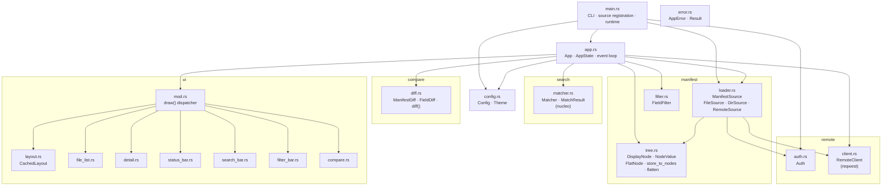
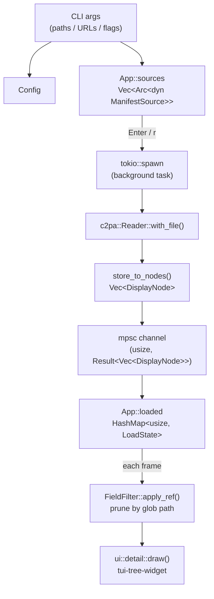
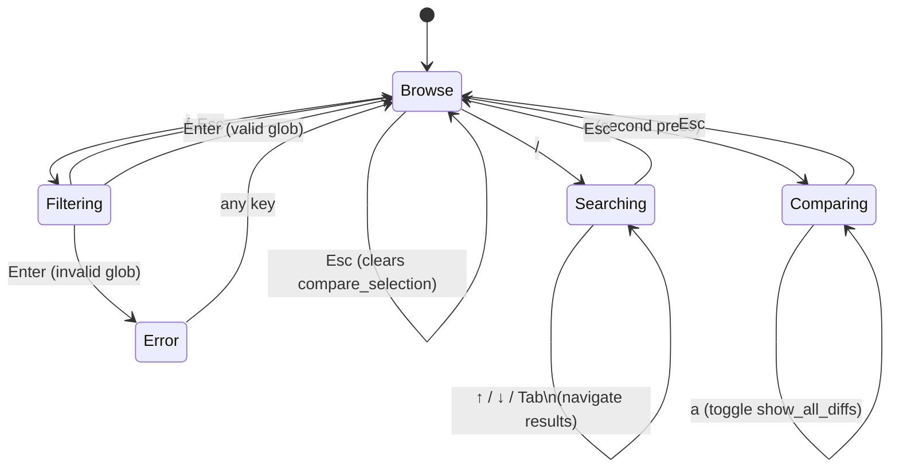
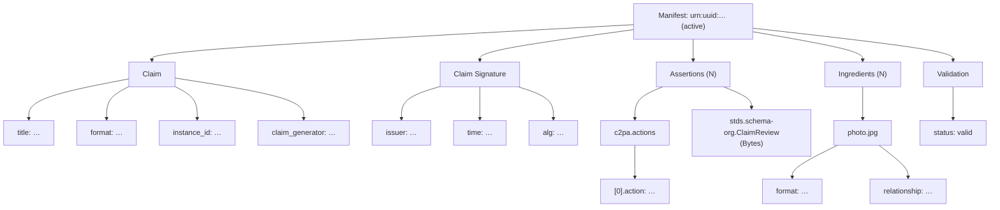
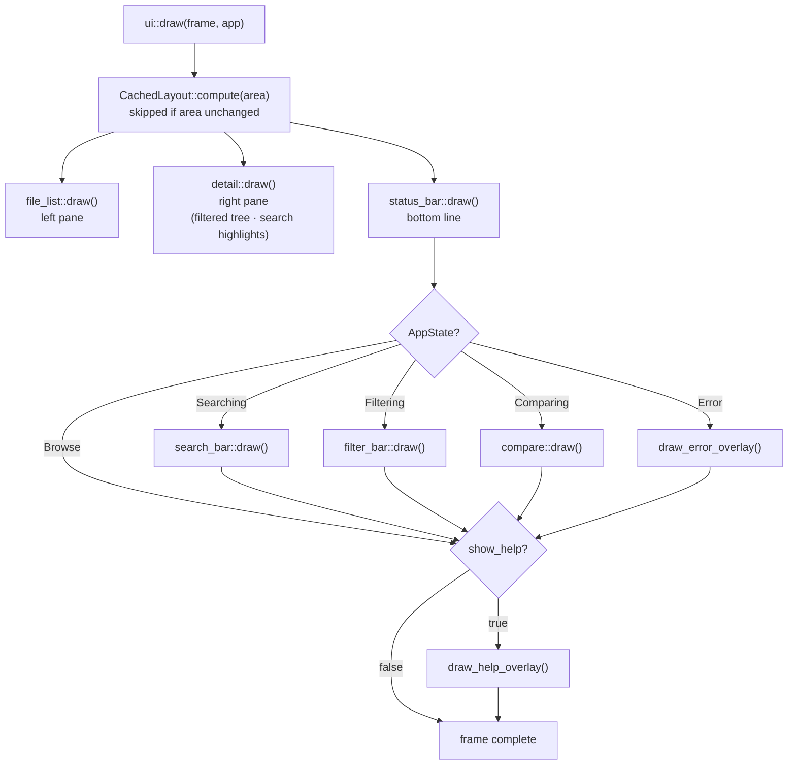
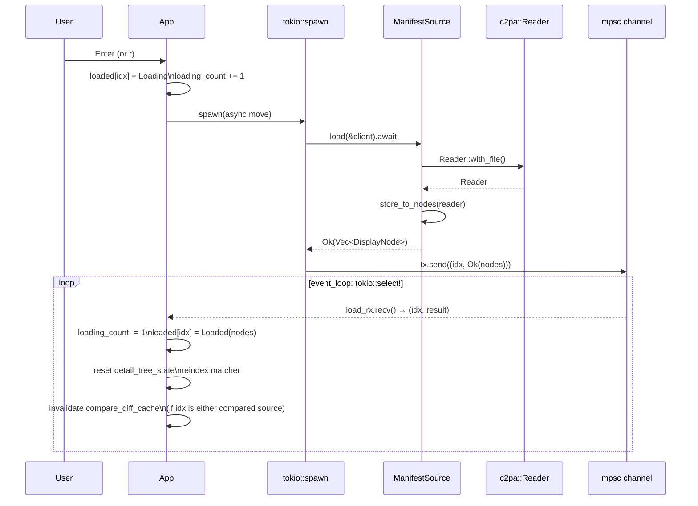

# c2pa-tui Architecture

Terminal UI for browsing and comparing C2PA manifests. Built on [ratatui](https://ratatui.rs/) + crossterm, driven by a tokio async event loop.

---

## Directory layout

```
c2pa-tui/
├── src/
│   ├── main.rs          # CLI entry point (clap), source registration, runtime bootstrap
│   ├── lib.rs           # Public module declarations
│   ├── app.rs           # App struct, state machine, event loop, key handlers
│   ├── config.rs        # Config struct, Theme enum, style helpers
│   ├── error.rs         # AppError enum (thiserror), Result alias
│   ├── manifest/
│   │   ├── loader.rs    # ManifestSource trait + FileSource / DirSource / RemoteSource
│   │   ├── tree.rs      # DisplayNode, NodeValue, FlatNode, store_to_nodes, flatten
│   │   └── filter.rs    # FieldFilter — glob-based include/exclude over node paths
│   ├── search/
│   │   └── matcher.rs   # Matcher — nucleo-backed fuzzy search, MatchResult
│   ├── compare/
│   │   └── diff.rs      # ManifestDiff, FieldDiff, diff()
│   ├── remote/
│   │   ├── auth.rs      # Auth enum (None / Basic / Bearer / Digest), from_spec()
│   │   └── client.rs    # RemoteClient — reqwest wrapper, retry, scheme guard
│   └── ui/
│       ├── mod.rs       # draw() top-level dispatcher, help/error overlays
│       ├── layout.rs    # CachedLayout, split helpers, centered_popup()
│       ├── file_list.rs # Left-pane file list widget
│       ├── detail.rs    # Right-pane manifest tree widget (tui-tree-widget)
│       ├── status_bar.rs# Bottom status line
│       ├── search_bar.rs# Search overlay widget
│       ├── filter_bar.rs# Filter overlay widget
│       └── compare.rs   # Side-by-side diff overlay widget
├── tests/
│   ├── integration_loader.rs   # FileSource / DirSource / RemoteSource against fixtures
│   ├── integration_remote.rs   # RemoteClient against wiremock server
│   └── snapshot_ui.rs          # insta snapshot tests for every widget
└── benches/
    └── draw.rs          # Criterion benchmark for one full draw() call
```

---

## Module map



---

## Data flow



---

## App state machine

`AppState` is the central discriminant that controls which key handlers and which UI overlays are active.



`StateKind` is a cheap copy of the discriminant used for dispatch — avoids cloning the heap-allocated `String` inside `Searching { query }` or `Filtering { query }` on every key event.

---

## Key types

### `App` ([app.rs](src/app.rs))

The single owner of all runtime state. Passed by `&mut` reference to every draw call and event handler.

| Field | Purpose |
|---|---|
| `sources` | `Vec<Arc<dyn ManifestSource>>` — all registered inputs |
| `loaded` | `HashMap<usize, LoadState>` — per-source load results |
| `selected_left` | Index of the file list's selected row |
| `compare_selection` | Index of the left-pinned source for comparison |
| `filter` | Active `FieldFilter` applied before every render |
| `matcher` | Nucleo-backed fuzzy search index for the selected manifest |
| `state` | `AppState` — drives overlay visibility and key routing |
| `compare_diff_cache` | `Option<ManifestDiff>` — cached diff, invalidated on reload |
| `layout_cache` | `Option<(Rect, CachedLayout)>` — invalidated on resize |
| `detail_tree_state` | Expand/collapse/scroll state for `tui-tree-widget` |
| `search_result_indices` | `HashSet<usize>` pre-computed from `search_results` to avoid per-frame allocation in the detail pane |

### `DisplayNode` ([manifest/tree.rs](src/manifest/tree.rs))

The universal representation of a parsed manifest. A recursive tree:

```rust
pub struct DisplayNode {
    pub key: String,        // field name or section label
    pub value: NodeValue,   // Str / Json / Bytes / Missing
    pub children: Vec<DisplayNode>,
}
```

`store_to_nodes` converts a `c2pa::Reader` into this tree. Each manifest becomes one root node with five fixed children: **Claim**, **Claim Signature**, **Assertions**, **Ingredients**, **Validation**.



`flatten` DFS-walks the tree into `Vec<FlatNode>` (dot-joined paths) for the search engine.

### `ManifestSource` ([manifest/loader.rs](src/manifest/loader.rs))

```rust
#[async_trait]
pub trait ManifestSource: Send + Sync {
    fn label(&self) -> &str;
    async fn load(&self, client: &RemoteClient) -> Result<Vec<DisplayNode>>;
    fn is_remote(&self) -> bool { false }
}
```

Three concrete implementations:

| Type | Input | Notes |
|---|---|---|
| `FileSource` | Single local path | Checks extension against MIME allowlist |
| `DirSource` | Directory | `walkdir` expand; each file gets its own row |
| `RemoteSource` | `https://` URL | Downloads to tempfile, delegates to `FileSource::load` |

### `FieldFilter` ([manifest/filter.rs](src/manifest/filter.rs))

Parses a semicolon-separated glob query (`assertions.*; !Claim Signature`) into include/exclude pattern lists. Applied on every render via `apply_ref` (borrow-based, only clones surviving nodes).

### `Matcher` ([search/matcher.rs](src/search/matcher.rs))

Wraps the `nucleo` fuzzy-matching engine. `index(nodes)` feeds a `FlatNode` list; `query(pattern)` returns ranked `MatchResult`s with byte-range highlights. Re-indexed whenever the selected manifest changes.

### `ManifestDiff` ([compare/diff.rs](src/compare/diff.rs))

`diff(left_label, left_nodes, right_label, right_nodes)` flattens both trees to `IndexMap<path, display>` and emits one `FieldDiff` per union key:

- `Equal { path, value }` — same value in both
- `Changed { path, left, right }` — value differs
- `OnlyLeft { path, value }` — missing from right
- `OnlyRight { path, value }` — missing from left

Left DFS order is preserved; right-only fields are appended. The result is cached in `App::compare_diff_cache` and only recomputed when either source reloads or the pair changes.

---

## Rendering pipeline

Every iteration of the event loop calls `ui::draw(frame, app)`:



`CachedLayout` stores four `Rect`s computed once per terminal size. It is also used for mouse hit-testing so click coordinates are always consistent with what was rendered.

---

## Async loading



The channel is unbounded so `tokio::spawn` never blocks. `loading_count` tracks in-flight tasks for the status bar spinner.

---

## Configuration

`Config` is constructed in `main.rs` from CLI flags and passed into `App::new`. Nothing reads environment variables at runtime — all configuration is resolved before the event loop starts.

| Flag | Field | Default |
|---|---|---|
| `--theme dark\|light\|mono` | `Theme` | `Dark` |
| `--no-mouse` | `mouse_enabled` | `true` |
| `--filter <glob>` | `initial_filter` | `None` |
| `--auth <spec>` | `Auth` | `None` |
| _(internal)_ | `left_pane_pct` | `25` |

`Theme` owns all styling via methods (`border_focused`, `highlight`, `match_highlight`, `diff_changed`, `diff_only_left`, `diff_only_right`) so widget code never hard-codes colors.

---

## Error handling

`AppError` (thiserror) unifies all failure modes. Errors from background loads are converted to `AppState::Error { message }` pre-formatted for display — one allocation at load time, zero on every subsequent frame redraw. Any key press dismisses the error and returns to `Browse`.

---

## Testing

| Layer | Approach |
|---|---|
| Unit | `#[cfg(test)]` modules inline in every source file; proptest for `diff`, `filter`, `matcher`, `auth` |
| Integration | `tests/integration_loader.rs` — real fixture files; `tests/integration_remote.rs` — wiremock HTTP server |
| Snapshot | `tests/snapshot_ui.rs` — insta snapshots for every widget variant |
| Benchmark | `benches/draw.rs` — criterion benchmark for a full `draw()` call with loaded manifest |
